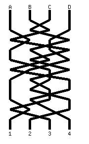

<!-- RATING: HARD -->
<!-- NAME:  CROSSING LINES -->
<!-- GENERATOR: generate.pl -->
# CROSSING LINES

Our agents have infiltrated a compromised facility where AI operatives have rewired the cables. The agents have the original connection diagrams on site, but are having difficulty establishing which connections have been rewired. Some idiot used the same color for all the networking cables. They need your assistance deciphering which cables are plugged into to which ports. If they disconnect the wrong cables, the AI will know it has been discovered. It is critical that this not happen.

## INPUT
Agents have sent along a Base64-encoded string. When decoded, this string contains a JPG image showing the current layout of the cables:

At the top, cables are labeled A,B,C, and D. The ports are labelled 1,2,3, and 4 at the bottom.

## OUTPUT
You must output the cables and the ports they are plugged into, one per line, starting with A and ending with D.

## SAMPLE INPUT
/9j/4AAQSkZJRgABAQAAAQABAAD//gA+Q1JFQVRPUjogZ2QtanBlZyB2MS4wICh1c2luZyBJSkcg
SlBFRyB2ODApLCBkZWZhdWx0IHF1YWxpdHkK/9sAQwAIBgYHBgUIBwcHCQkICgwUDQwLCwwZEhMP
FB0aHx4dGhwcICQuJyAiLCMcHCg3KSwwMTQ0NB8nOT04MjwuMzQy/9sAQwEJCQkMCwwYDQ0YMiEc
ITIyMjIyMjIyMjIyMjIyMjIyMjIyMjIyMjIyMjIyMjIyMjIyMjIyMjIyMjIyMjIyMjIy/8AAEQgB
.
.
.
.
02XUA6uLt7VGlDLjad5GcjAwc8YFalFFABRRRQAVlzeGtBudUGqT6JpsuoB1cXb2qNKGXG07yM5G
Bg54wK1KKACiiigAooooApyaTps2qQ6pLp9o+oQpsiu2hUyovPCvjIHzNwD3PrVyiigAooooAKjk
ghmeF5Yo3eF98TMoJRtpXK+h2swyOxI71JRQAUUUUAFFFFABRRRQAUUUUAFFFFABRRRQAUUUUAFF
FFABRRRQAUUUUAFFFFABRRRQAUUUUAFFFFABRRRQB//Z

## SAMPLE OUTPUT
A2
B4
C1
D3

